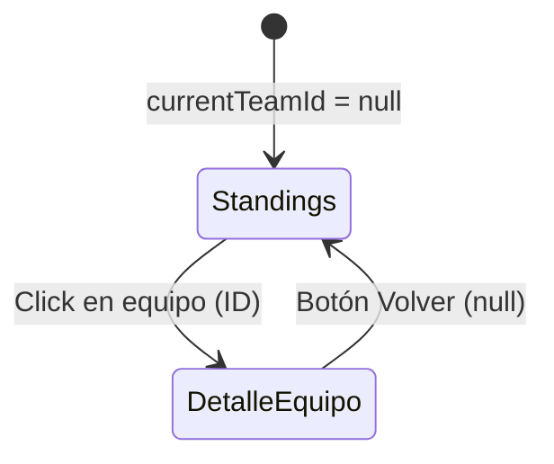

# La Liga - Rama `01-vite`

Esta rama se centra exclusivamente en el **tooling moderno** y el rol de un bundler en el desarrollo web actual. Utilizamos JS Vanilla para mantener el foco en cómo Vite transforma y sirve nuestros archivos.

**Consulta el [GLOBALREADME.md](./GLOBALREADME.md) para ver la estructura completa del proyecto, configuración de la API y Docker.**

---

## Objetivos de esta Rama

El propósito es mostrar en vivo qué hace un bundler. Cada decisión arquitectónica resalta un concepto de Vite:

| Decisión | Concepto de Vite |
|---|---|
| Importar CSS en JS | Pipeline de assets |
| Importar PNG como módulo | Manejo de assets estáticos |
| `import.meta.env` | Variables de entorno en el servidor |
| Configuración de Proxy | CORS y seguridad de API Keys |
| ES Modules | Resolución de módulos / bundling |
| `npm run dev` vs `build` | HMR vs Bundle de producción |

---

## Estructura de Carpetas

```
la-liga-explorer/ (Rama 01-vite)
├── index.html               ← Único punto de entrada
├── vite.config.js           ← Configuración del Proxy
└── src/
    ├── main.js              ← Entry point, maneja el estado de la vista
    ├── api.js               ← Abstracción de fetch (usa /api/)
    ├── assets/              ← Imágenes importadas en JS
    ├── css/                 ← Estilos importados en JS
    └── components/          ← Funciones de renderizado DOM
```

---

## Implementación Técnica

### Manejo de Estado
En esta fase, la navegación es rudimentaria. `main.js` mantiene una variable `currentTeamId`:
- `null`: Renderiza `TeamList`.
- `ID`: Renderiza `TeamDetail`.

### El Proxy de Vite (CORS)
Evitamos errores de CORS y exposición de llaves configurando el proxy en `vite.config.js`:

```js
proxy: {
  '/api': {
    target: 'https://api.football-data.org',
    changeOrigin: true,
    rewrite: (path) => path.replace(/^\/api/, '/v4'),
    headers: { 'X-Auth-Token': env.VITE_API_KEY }
  }
}
```

---

## Flujo de la Aplicación


