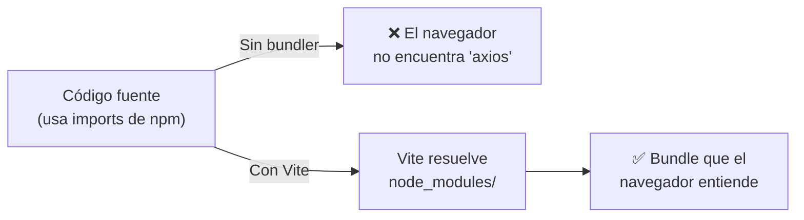
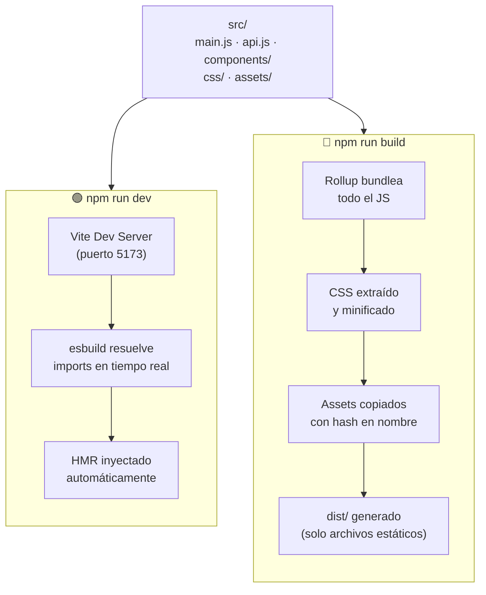
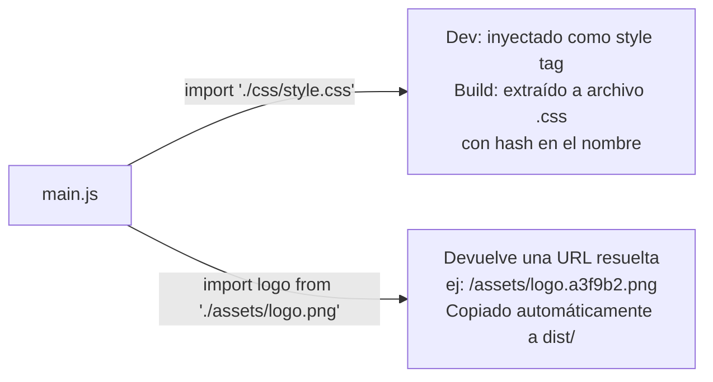
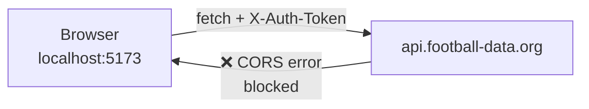
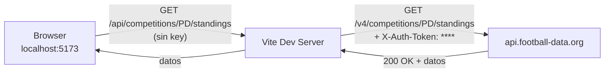
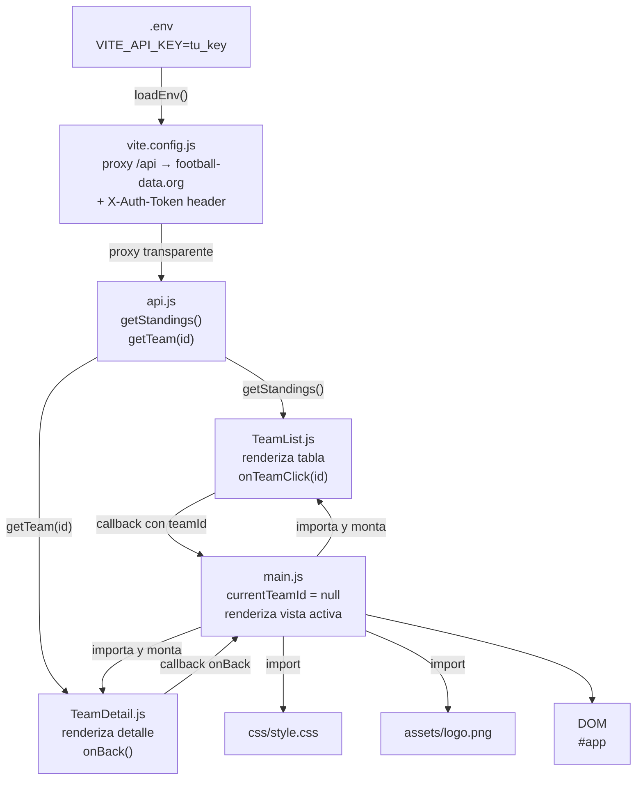
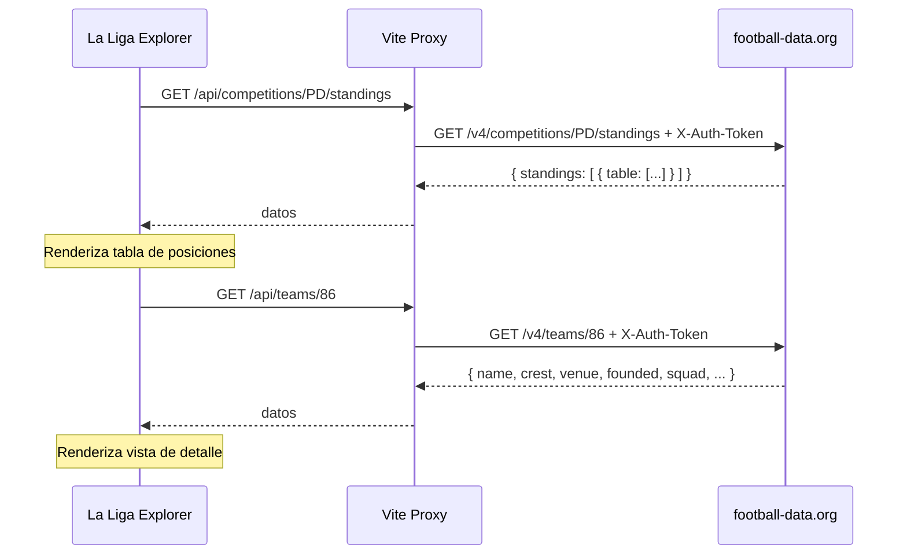
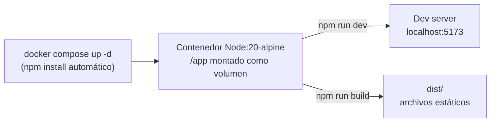
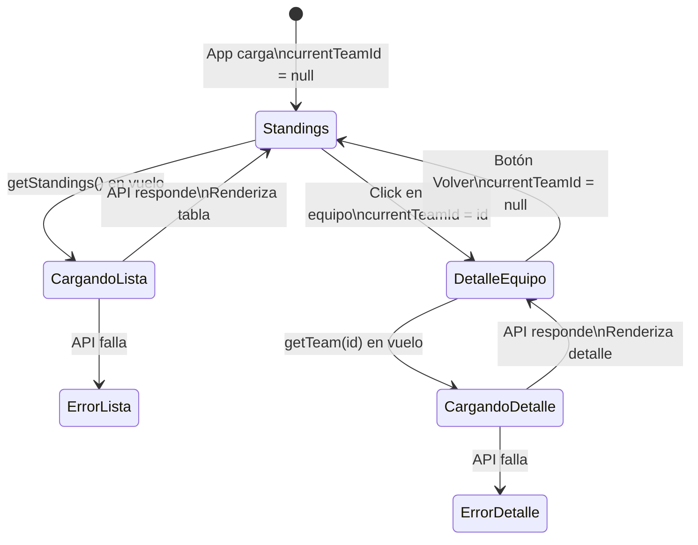

# La Liga

Proyecto de demostración en clase construido para mostrar **Vite** como bundler moderno de JavaScript. La aplicación consume la API de **football-data.org** para mostrar la tabla de posiciones de La Liga y permite hacer drill-down hacia el detalle de cada equipo. Es intencionalmente sin framework (JS vanilla + DOM) para que el foco permanezca completamente en el rol de Vite en el pipeline de build.

---

## Objetivos del Proyecto

El propósito es mostrar en vivo, en clase, qué hace un bundler y por qué importa. Cada decisión arquitectónica está tomada para resaltar un concepto específico de Vite:

| Decisión | Concepto de Vite que demuestra |
|---|---|
| Importar CSS dentro de un archivo JS | Pipeline de assets |
| Importar un PNG como módulo JS | Manejo de assets estáticos |
| Usar `import.meta.env.VITE_*` en `vite.config.js` | Variables de entorno en el servidor de Vite |
| Configurar un proxy en `vite.config.js` | CORS y por qué las API keys no deben ir al browser |
| Estructura multi-archivo con ES Modules | Resolución de módulos / bundling |
| `npm run dev` vs `npm run build` | Dev server (HMR) vs bundle de producción |

---

## Estructura de Carpetas

```
la-liga-explorer/
├── Dockerfile
├── docker-compose.yml
├── .dockerignore
├── .env                     ← secretos reales, nunca se hace commit
├── .env.example             ← se hace commit, muestra las variables requeridas
├── .gitignore
├── index.html               ← único punto de entrada HTML
├── package.json
├── vite.config.js           ← base, proxy y configuración del dev server
└── src/
    ├── main.js              ← entry point de la app, conecta las vistas
    ├── api.js               ← toda la lógica de fetch, exportada como funciones
    ├── assets/
    │   └── logo.png         ← importado como módulo JS a través de Vite
    ├── css/
    │   └── style.css        ← importado directamente en main.js
    └── components/
        ├── TeamList.js      ← renderiza la tabla de posiciones
        └── TeamDetail.js    ← renderiza la vista de detalle del equipo
```

---

## Stack Tecnológico

### Vite

**Vite** (francés para "rápido") es una herramienta de build frontend de nueva generación creada por Evan You (creador de Vue.js). Resuelve dos problemas: un servidor de desarrollo rápido y un build de producción optimizado.

#### El problema que Vite resuelve

Sin bundlers, los navegadores no pueden resolver paquetes de npm. Si intentaras:

```js
import axios from 'axios'; // dentro de un <script type="module">
```

El navegador lanzaría un error de red porque intentaría buscar un archivo literalmente llamado `axios` en el servidor. Los bundlers interceptan esto en tiempo de build y resuelven el import al archivo real dentro de `node_modules/`.



---

#### Flujo completo: Dev vs Producción



---

#### Pipeline de assets de Vite

Vite no solo bundlea JS — también transforma otros tipos de archivos cuando los importas dentro de un módulo JS:



---

### CORS y el Proxy de Vite

#### El problema: CORS

Cuando el browser intenta hacer un `fetch` directamente a `api.football-data.org` con un header `X-Auth-Token`, el servidor bloquea el request con un error **CORS** (Cross-Origin Resource Sharing). Esto es una protección del navegador: solo permite requests a orígenes distintos si el servidor los autoriza explícitamente.



#### La solución: Proxy en vite.config.js

Configuramos Vite para que actúe como intermediario. El browser habla con Vite (mismo origen, sin CORS), y Vite reenvía el request a la API añadiendo el header con la key. La key **nunca llega al browser**.



```js
// vite.config.js
proxy: {
  '/api': {
    target: 'https://api.football-data.org',
    changeOrigin: true,
    rewrite: (path) => path.replace(/^\/api/, '/v4'),
    headers: { 'X-Auth-Token': env.VITE_API_KEY }
  }
}
```

> **Punto clave para la demo:** La API key vive en `vite.config.js` (Node.js, lado servidor) cargada con `loadEnv`. Nunca se incluye en el bundle que descarga el browser. Esto contrasta con usar `import.meta.env.VITE_API_KEY` directamente en el código del browser, donde la key quedaría expuesta en el bundle.

---

### Arquitectura de Módulos ES



**Regla clave:** Solo `main.js` conoce ambos componentes. Solo `api.js` hace llamadas `fetch`. Los componentes no saben nada el uno del otro.

---

### football-data.org API

[football-data.org](https://www.football-data.org) es una API REST de datos futbolísticos. Requiere registro gratuito (solo email) para obtener una API key personal.

**Base URL:** `https://api.football-data.org/v4/`
**Auth:** Header `X-Auth-Token: TU_KEY` (añadido por el proxy, no por el browser)
**La Liga code:** `PD` (Primera División)



**Campos clave — standings:**

| Campo | Contenido |
|---|---|
| `position` | Posición en la tabla |
| `team.id` | ID único del equipo |
| `team.name` | Nombre del equipo |
| `team.crest` | URL al escudo (SVG) |
| `playedGames` | Partidos jugados |
| `won` / `draw` / `lost` | Victorias / empates / derrotas |
| `goalDifference` | Diferencia de goles |
| `points` | Puntos |

**Campos clave — detalle de equipo:**

| Campo | Contenido |
|---|---|
| `name` | Nombre completo |
| `tla` | Abreviatura (ej: RMA) |
| `crest` | URL al escudo |
| `venue` | Estadio |
| `founded` | Año de fundación |
| `clubColors` | Colores del club |
| `website` | Sitio web oficial |
| `coach` | Entrenador actual |
| `squad` | Lista de jugadores |

---

### Variables de Entorno

Vite usa un sistema de archivos `.env`. En este proyecto, la key se usa **solo en `vite.config.js`** (Node.js), no en el código del browser.

#### `.env` (nunca hacer commit)
```
VITE_API_KEY=tu_key_de_football_data
VITE_APP_TITLE=La Liga Explorer
```

#### `.env.example` (siempre hacer commit)
```
VITE_API_KEY=
VITE_APP_TITLE=
```

---

### Docker

El contenedor provee el entorno Node.js. El desarrollador corre los comandos manualmente desde dentro.



---

## Flujo de la Aplicación



---

## Comandos

Todo se ejecuta **desde dentro del contenedor**. No se necesita Node.js instalado en la máquina host.

### 1. Levantar el contenedor

```bash
cp .env.example .env
# Editar .env con tu API key de football-data.org

docker compose up -d   # npm install corre automáticamente
docker compose exec app sh
```

A partir de aquí, todos los comandos se ejecutan **dentro de la shell del contenedor**.

### 2. Modo desarrollo (con HMR)

```bash
npm run dev
# Disponible en http://localhost:5173
```

### 3. Build de producción

```bash
npm run build
# Genera la carpeta dist/
```

---

## Script de Demo (Flujo Sugerido en Clase)

1. **El problema:** Mostrar un `index.html` plano intentando `import axios from 'axios'`. Dejar que falle en la consola. Preguntar: *"¿Por qué falla?"*
2. **Scaffolding con Vite:** Ejecutar `npm create vite@latest` en vivo. Recorrer lo que se generó.
3. **El dev server:** Editar un archivo, observar HMR actualizar el navegador al instante.
4. **El módulo API:** Crear `api.js`, mostrar named exports y que solo usa `/api/` como base URL.
5. **CORS en vivo:** Intentar hacer el fetch directo al API sin proxy. Mostrar el error CORS en la consola. Luego agregar el proxy en `vite.config.js` y explicar por qué la key no debe ir al browser.
6. **CSS import:** Agregar `import './css/style.css'` dentro de un JS. Explicar qué hace Vite con esto.
7. **Asset import:** Importar el logo PNG en JS, usarlo en un ``.
8. **Build de producción:** Ejecutar `npm run build`. Mostrar `dist/` — nombres con hash, bundle minificado.
9. **Docker:** Mostrar que todo corre dentro del contenedor — la máquina host no necesita Node.js.

---

## Notas para Claude Code

Al implementar este proyecto, seguir estas restricciones estrictamente:

- **Sin framework.** Solo JS vanilla. Sin React, Vue ni Svelte.
- **Sin TypeScript.** Solo archivos `.js` planos.
- **El CSS debe vivir en `src/css/style.css`** e importarse en `main.js`.
- **El logo debe vivir en `src/assets/logo.png`** e importarse en `main.js`.
- **Todas las llamadas a la API van solo en `src/api.js`.** Los componentes no usan `fetch` directamente.
- **`main.js` es el único archivo que importa ambos componentes.** Mantiene `currentTeamId` (null = standings, número = detalle).
- **El proxy va en `vite.config.js`** usando `loadEnv`. La API key nunca va en el código del browser.
- **`api.js` usa `/api/` como BASE_URL** — el proxy de Vite la redirige a `football-data.org`.
- **`.env.example`** debe incluir todas las variables `VITE_*` con valores vacíos. `.env` va en `.gitignore`.
- Mostrar estado de carga (`loading`) mientras las llamadas están en vuelo.
- Mostrar estado de error si la llamada falla.
- La vista de standings usa zonas de color: Champions (azul, top 4), Europa (naranja, 5-6), descenso (rojo, 18-20).
- La vista de detalle muestra: escudo, nombre, TLA, estadio, año de fundación, colores, web, entrenador y plantilla.
