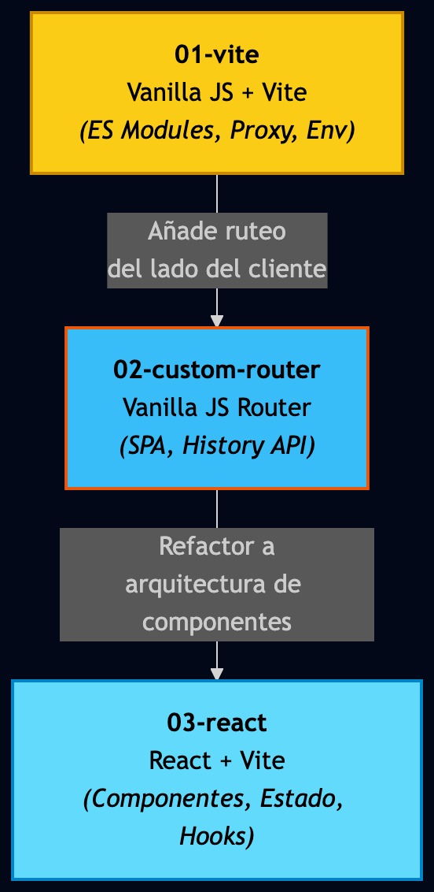
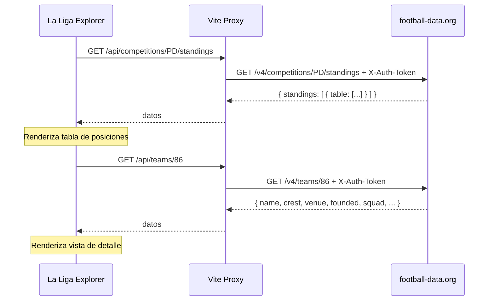
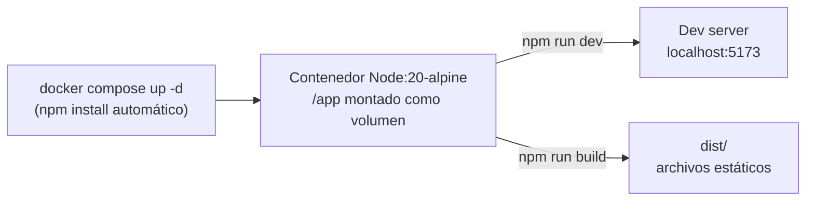

# La Liga - Proyecto de Aprendizaje Evolutivo

Este repositorio es un proyecto de demostración diseñado para mostrar la evolución de una aplicación web moderna, desde JS Vanilla hasta React, pasando por la implementación manual de enrutamiento y el uso de herramientas de construcción modernas como **Vite**.

La aplicación consume la API de **football-data.org** para mostrar la tabla de posiciones de La Liga y permite navegar hacia el detalle de cada equipo. El objetivo principal es que los estudiantes puedan ver la progresión y las diferencias arquitectónicas al cambiar entre distintas ramas (*branches*).

---

## Estructura de Ramas

El proyecto está organizado en ramas secuenciales. Cada rama representa un hito en el desarrollo y añade una nueva capa de complejidad o una herramienta diferente:



1.  **`main`**: Esta rama. Actúa como índice y contiene la visión general del proyecto y la descripción de cada etapa.
2.  **`01-vite`**:
    *   **Foco:** Tooling moderno con Vite.
    *   **Arquitectura:** JS Vanilla + ES Modules.
    *   **Estado:** Manejo de estado simple (variable global) para alternar entre vistas.
    *   **Conceptos clave:** Pipeline de assets, proxy de API, variables de entorno.
3.  **`02-manual-router`**:
    *   **Foco:** Enrutamiento en el lado del cliente (SPA).
    *   **Arquitectura:** Implementación de una clase `Router` manual usando la API de History del navegador.
    *   **Conceptos clave:** Deep linking, navegación sin recarga de página, parseo de parámetros en URL (ej: `/team/:id`).
4.  **`03-react`**:
    *   **Foco:** Migración a Framework.
    *   **Arquitectura:** Refactorización completa a componentes de React.
    *   **Conceptos clave:** Declaratividad, manejo de estado con hooks, props y modularización de la UI.

---

## Cómo usar este repositorio

Para explorar las diferentes etapas del proyecto, simplemente cambia a la rama correspondiente utilizando tu terminal:

```bash
git checkout 01-vite
git checkout 02-manual-router
git checkout 03-react
```

**Nota importante:** Cada rama contiene su propio archivo `README.md` con las instrucciones específicas sobre la estructura de carpetas, comandos de Docker y npm, y explicaciones teóricas detalladas para esa etapa en particular.

---

## football-data.org API

[football-data.org](https://www.football-data.org) es una API REST de datos futbolísticos. Requiere registro gratuito (solo email) para obtener una API key personal.

**Base URL:** `https://api.football-data.org/v4/`
**Auth:** Header `X-Auth-Token: TU_KEY` (añadido por el proxy, no por el browser)
**La Liga code:** `PD` (Primera División)



---

## Docker & Infraestructura

El contenedor provee el entorno Node.js uniforme para todas las etapas del proyecto. El desarrollador corre los comandos manualmente desde dentro.



### Comandos Generales

Todo se ejecuta **desde dentro del contenedor**.

```bash
cp .env.example .env
# Editar .env con tu API key de football-data.org

docker compose up -d
docker compose exec app sh
# Dentro del contenedor:
npm run dev
```

---

## Stack Tecnológico Base

*   **Vite**: Bundler y Dev Server.
*   **Docker**: Entorno de desarrollo.
*   **ES Modules**: Sistema de módulos nativo.
*   **Vanilla CSS**: Estilos sin frameworks.
